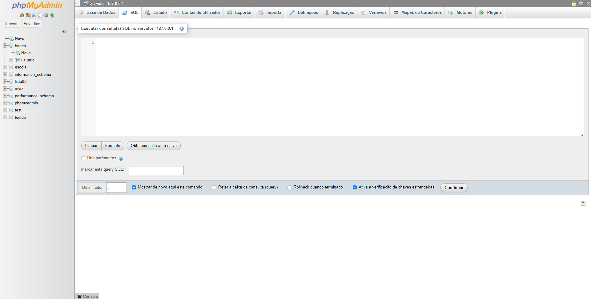
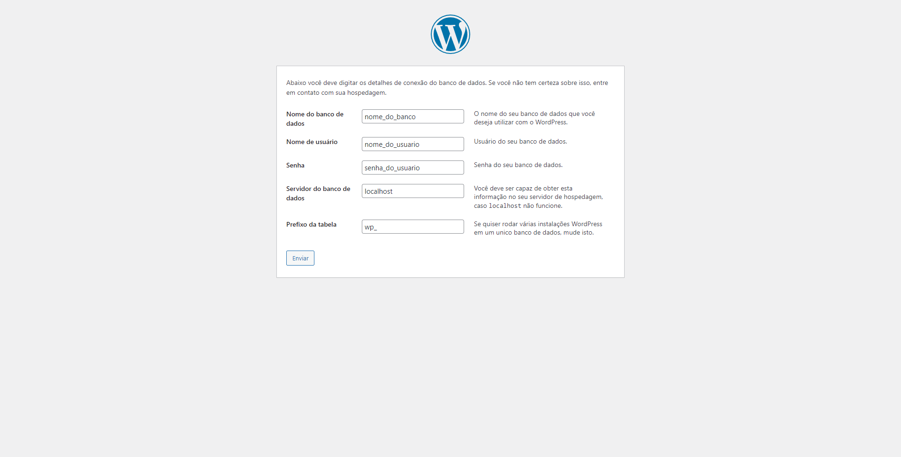
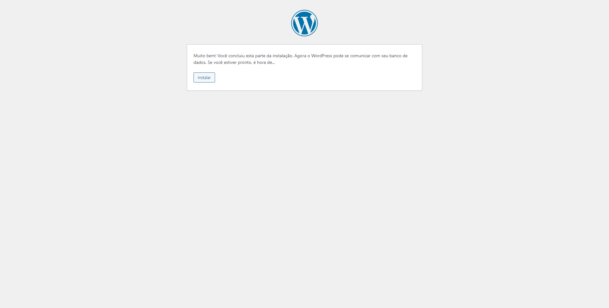
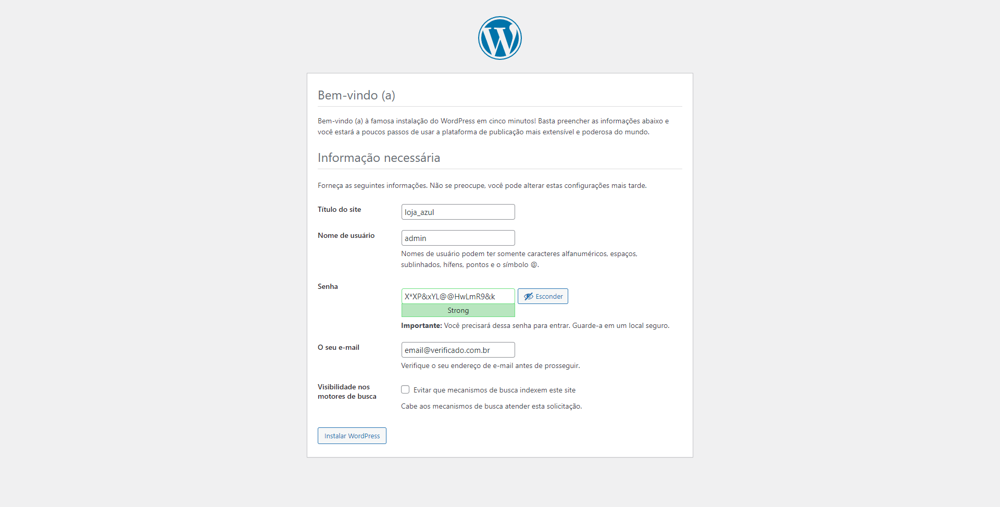
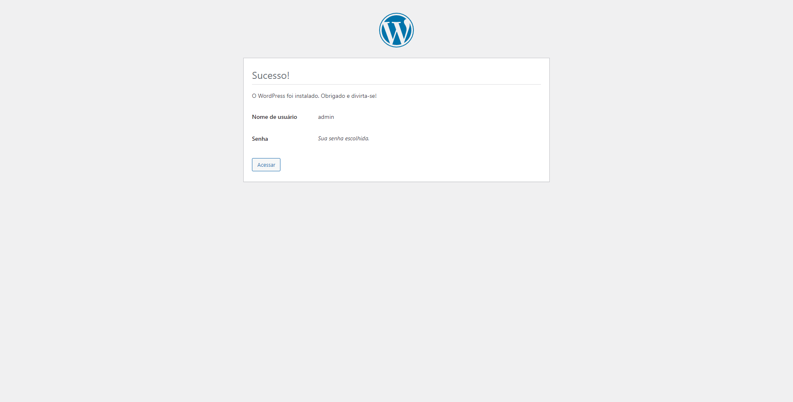
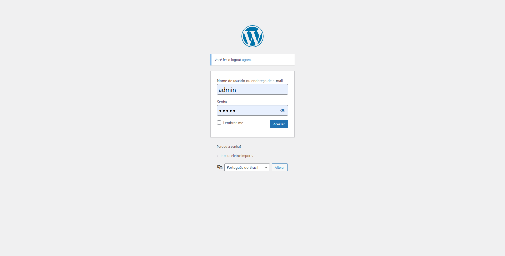
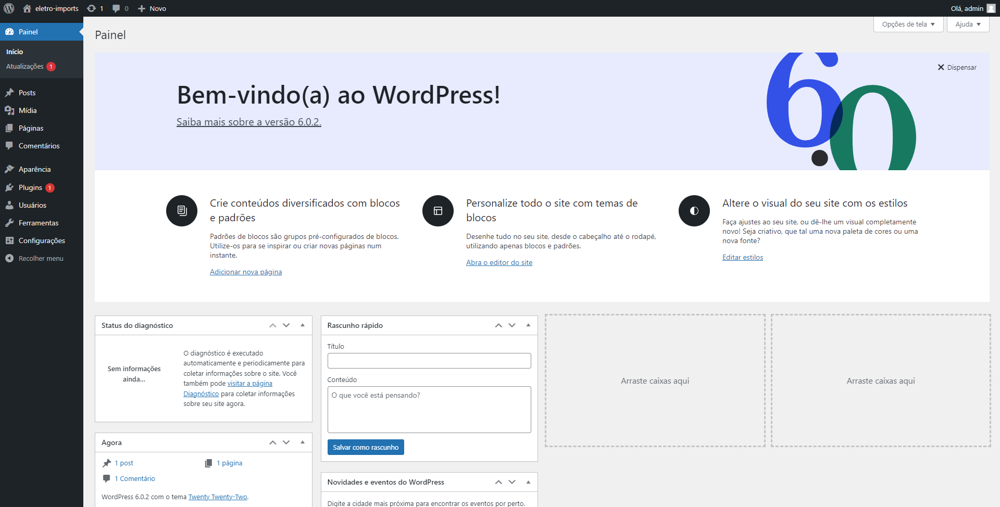

# Artigos: Instalação - Wordpress

Autor: Lucas de Oliveira Neitzke

[Retornar: Wordpress](../wordpress.md)

## Sumário

- [Artigos: Instalação - Wordpress](#artigos-instalação---wordpress)
  - [Sumário](#sumário)
  - [Introdução](#introdução)
  - [Iniciando o ambiente](#iniciando-o-ambiente)
  - [Instalação](#instalação)
    - [Passo a passo](#passo-a-passo)
    - [Criando o banco de dados](#criando-o-banco-de-dados)
    - [Instalação Expressa](#instalação-expressa)
      - [Finalizando a instalação](#finalizando-a-instalação)
    - [Arquivo de configuração da instalação](#arquivo-de-configuração-da-instalação)
      - [Variaveis de configuração](#variaveis-de-configuração)
      - [Arquivo de configuração padrão](#arquivo-de-configuração-padrão)
  - [Referências](#referências)

## Introdução

Antes de iniciar a instalação, há algumas coisas que você precisa ter e fazer. 

Tenha em sua máquina instalado os seguintes items:

- PHP: Software de linguagem de programação
- Servidor Apache: Software de infraestrutura HTTP
- Servidor MySQL: Software de banco de dados
- phpMyAdmin: Software de gerenciamento de banco de dados


Dependendo da versão do Wordpress, será requisitado que a versão do servidor Apache e(ou) MySQL alternem, tenha bastante atenção com a compatibilidade das versões dos softwares.

## Iniciando o ambiente

Existem softwares que fazem toda a parte burocrática por nós, cuidando assim da maior parte da configuração de um servidor habilitado para utilizar o Wordpress. Os nomes mais conhecidos do mercado são:

- [Xampp](https://www.apachefriends.org/)
- [Wampp](https://www.wampserver.com/)
- [EasyPHP](https://www.easyphp.org/)

## Instalação

Para baixar o Wordpress basta você visitar a o [site oficial](https://wordpress.org/download/releases/) e ir até a seção de downloads. Feito isso basta escolher a versão desejada e baixar o arquivo (.zip) compactado.

### Passo a passo

Após baixada a versão desejada, siga os seguintes passos:

1) Fazer o upload do arquivo baixado para a pasta raiz ou na pasta do subdominio desejado.
2) Extrair o conteúdo do arquivo compactado baixado na pasta escolhida.
3) Criar um banco de dados com o agrupamento de caracteres usando a codificação `utf-8`, definindo o banco de dados em `CHARSET=utf8` e ` COLLATE=utf8_general_ci`.
4) Configuração do arquivo de instalação `wp-config.php`


### Criando o banco de dados

Após instalar um software de servidor e gerenciamento de banco de dados, abra o gerenciador e procure por uma opção de executar "SQL".

Nesse exemplo iremos utilizar o *phpMyAdmin* que vem acompanhado com o *Xampp*.



Com o gerenciador aberto, execute o seguinte comando, substituindo o `nome_do_banco` pelo nome do banco desejado.

```sql
CREATE DATABASE nome_do_banco CHARSET=utf8 COLLATE=utf8_general_ci; 
```

Caso o banco de dados já exista, execute este código abaixo, no qual ele irá excluir o banco de dados alvo, substituindo `nome_do_banco` pelo nome do banco desejado, execute a linha abaixo e após isso, execute novamente o código da instrução `CREATE DATABASE`.

```sql
USE nome_do_banco;
DROP DATABASE IF EXISTS nome_do_banco;
```

Após isso temos que dar os devidos privilégios para o usuario criado anteriormente, para isso, execute os comandos, substituindo o `nome_do_banco`, `nome_do_usuario` e a `senha_do_usuario`.


```sql
USE nome_do_banco;
CREATE OR REPLACE USER 'nome_do_usuario'@'%' IDENTIFIED BY 'senha_do_usuario';
GRANT ALL PRIVILEGES ON nome_do_banco.* TO 'nome_do_usuario'@'%' WITH GRANT OPTION;
```

### Instalação Expressa

A instalação de Wordpress é facilitada aos usuários que não tem tanta experiencia com programação. Para iniciar a configuração expressa acesse o endereço onde o Wordpress foi extraido em seu navegador. Nesse exemplo estamos com o Wordpress extraido na pasta `loja-azul` dentro da raiz, ou seja, uma pasta em carater de subdominio. 

1) Acesse o endereço e selecione o idioma(*http://localhost/loja-azul/*)


2) Clique em "vamos lá", para continuar.


3) Configure todos os campos especificados abaixo:



4) Caso o instalador consiga se conectar com o banco de dados, aparecerá a seguinte mensagem.



Ao clicar em "Instalar" você será redirecionado até a página de finalização da instalação.

#### Finalizando a instalação

Caso a instalação tenha ocorrido com sucesso, será aberta uma página para você iniciar a configuração básica do Wordpress. Neles serão requisitadas as seguintes informações:



- Nome do site (Site title).
- Nome de usuário administrador (Username).
- Senha de acesso do usuário administrador (Password).
- Seu e-mail utilizado para recuperar a senha (Your email).
- Habilitar a indexação aos mecanismos de pesquisa (Search Engine Visibility): Caso você marque essa opção o seu site Wordpress não aparecerá em nenhum site de busca, como Google, Bling e etc.

Após preenchido todos os dados de configuração, aparecerá a seguinte tela:



Caso você tenha exito na instalação, você será redirecionado para a página de login do Wordpress.



E posteriormente a sua tela inicial.



### Arquivo de configuração da instalação

Você pode criar e editar o arquivo `wp-config.php` você mesmo ou pode pular esta etapa e deixar o WordPress tentar fazer isso sozinho ao executar a [Instalação expressa](#instalação-expressa). Nas versões mais atuais já vem com um arquivo de configuração de exemplo, chamado `wp-config-sample.php`, você pode renomea-lo para `wp-config.php` e alterar as variaveis de configuração.

#### Variaveis de configuração

Essas varaiveis são encontradas dentro do arquivo de configuração do Wordpress `wp_config.php`.

- `DB_NAME`: O nome do banco de dados que você criou para o WordPress.
- `DB_USER `: O nome de usuário que você criou para o banco.
- `DB_PASSWORD`: A senha que você escolheu para o nome de usuário.
- `DB_HOST`: O nome do host que você determinou, normalmente `localhost`.
- `DB_CHARSET`: O conjunto de caracteres do banco de dados.

#### Arquivo de configuração padrão

Quando extraimos o Wordpress, ele vem acompanhado de um arquivo de exemplo de configuração, nele são colocadas as configurações referentes a configuração e inicialização do software. Esse arquivo foi retirado do código fonte da versão 6.0.2 para exemplificação, podem haver alternancia entre as versões, você pode verificar a versão atual do arquivo de configuração diretamente no [repositório](https://github.com/WordPress/WordPress/blob/master/wp-config-sample.php).

A principal diferença entre a instalação expressa e a manual é que na manual podemos atribuir as chaves de encriptação nós mesmo, assim como a habilitação do depurador do Wordpress.

```php
<?php
/**
 * The base configuration for WordPress
 *
 * The wp-config.php creation script uses this file during the installation.
 * You don't have to use the web site, you can copy this file to "wp-config.php"
 * and fill in the values.
 *
 * This file contains the following configurations:
 *
 * * Database settings
 * * Secret keys
 * * Database table prefix
 * * ABSPATH
 *
 * @link https://wordpress.org/support/article/editing-wp-config-php/
 *
 * @package WordPress
 */

// ** Database settings - You can get this info from your web host ** //
/** The name of the database for WordPress */
// NOME DO BANCO DE DADOS
define( 'DB_NAME', 'database_name_here' );

/** Database username */
// NOME DO USUARIO
define( 'DB_USER', 'username_here' );

/** Database password */
// SENHA DO USUARIO
define( 'DB_PASSWORD', 'password_here' );

/** Database hostname */
// SERVIDOR DO BANCO DE DADOS (ENDERECO OU IP)
define( 'DB_HOST', 'localhost' );

/** Database charset to use in creating database tables. */
// CODIFICACAO DOS CARACTERES
define( 'DB_CHARSET', 'utf8' );

/** The database collate type. Don't change this if in doubt. */
// AGRUPAMENTO DO BANCO DE DADOS
define( 'DB_COLLATE', '' );

/**#@+
 * Authentication unique keys and salts.
 *
 * Change these to different unique phrases! You can generate these using
 * the {@link https://api.wordpress.org/secret-key/1.1/salt/ WordPress.org secret-key service}.
 *
 * You can change these at any point in time to invalidate all existing cookies.
 * This will force all users to have to log in again.
 *
 * @since 2.6.0
 */

// COLOQUE AQUI AS SUAS CHAVES PARA ENCRIPTACAO
define('AUTH_KEY', 'sua chave aqui');
define('SECURE_AUTH_KEY', 'sua chave aqui');
define('LOGGED_IN_KEY', 'sua chave aqui');
define('NONCE_KEY', 'sua chave aqui');
define('AUTH_SALT', 'sua chave aqui');
define('SECURE_AUTH_SALT', 'sua chave aqui');
define('LOGGED_IN_SALT', 'sua chave aqui');
define('NONCE_SALT', 'sua chave aqui');

/**#@-*/

/**
 * WordPress database table prefix.
 *
 * You can have multiple installations in one database if you give each
 * a unique prefix. Only numbers, letters, and underscores please!
 */

// PREFIXO DAS TABELAS NO BANCO DE DADOS
$table_prefix = 'wp_';

/**
 * For developers: WordPress debugging mode.
 *
 * Change this to true to enable the display of notices during development.
 * It is strongly recommended that plugin and theme developers use WP_DEBUG
 * in their development environments.
 *
 * For information on other constants that can be used for debugging,
 * visit the documentation.
 *
 * @link https://wordpress.org/support/article/debugging-in-wordpress/
 */

// EXIBIR ERROS E DEBUG DO WORDPRESS
define( 'WP_DEBUG', false );

/* Add any custom values between this line and the "stop editing" line. */


/* That's all, stop editing! Happy publishing. */

/** Absolute path to the WordPress directory. */
if ( ! defined( 'ABSPATH' ) ) {
	define( 'ABSPATH', __DIR__ . '/' );
}

/** Sets up WordPress vars and included files. */
require_once ABSPATH . 'wp-settings.php';

```

## Referências
Abaixo estão as referências utilizadas na confecção deste artigo.

- [How to install WordPress – WordPress.org Forums (https://wordpress.org/support/article/how-to-install-wordpress/)](https://wordpress.org/support/article/how-to-install-wordpress/)
- [Repositório oficial do Wordpress no Github (https://github.com/WordPress/WordPress)](https://github.com/WordPress/WordPress)
- [How To Create a New User and Grant Permissions in MySQL  | DigitalOcean (https://www.digitalocean.com/community/tutorials/how-to-create-a-new-user-and-grant-permissions-in-mysql)](https://www.digitalocean.com/community/tutorials/how-to-create-a-new-user-and-grant-permissions-in-mysql)
- [CREATE USER - MariaDB Knowledge Base (https://mariadb.com/kb/en/create-user/)](https://mariadb.com/kb/en/create-user/)
- [Creating Database for WordPress &#8211; WordPress.org Forum (https://wordpress.org/support/article/creating-database-for-wordpress/)](https://wordpress.org/support/article/creating-database-for-wordpress/)

[Próximo capitulo: Configuração](/wordpress/configuracao.md)