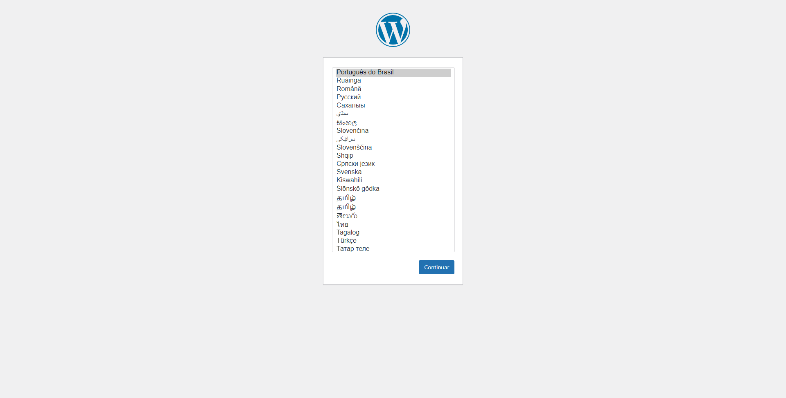

# Lucas de Oliveira Neitzke: Artigos - Wordpress | Instalação

[Retornar: Wordpress](../wordpress.md)

## Sumário

- [Lucas de Oliveira Neitzke: Artigos - Wordpress | Instalação](#lucas-de-oliveira-neitzke-artigos---wordpress--instalação)
  - [Sumário](#sumário)
  - [Introdução](#introdução)
  - [Iniciando o ambiente](#iniciando-o-ambiente)
  - [Instalação](#instalação)
    - [Passo a passo](#passo-a-passo)
      - [Arquivo de configuração da instalação](#arquivo-de-configuração-da-instalação)
        - [Variaveis de configuração](#variaveis-de-configuração)
      - [Instalando o Wordpress](#instalando-o-wordpress)
      - [Finalizando a instalação](#finalizando-a-instalação)
  - [Referências](#referências)

## Introdução

Antes de iniciar a instalação, há algumas coisas que você precisa ter e fazer. 

Tenha em sua máquina instalado os seguintes items:

- PHP: Software de linguagem de programação
- Servidor Apache: Software de infraestrutura HTTP
- Servidor MySQL: Software de banco de dados
- phpMyAdmin: Software de gerenciamento de banco de dados

Dependendo da versão do Wordpress, será requisitado que a versão do servidor Apache e(ou) MySQL alternem, tenha bastante atenção com a compatibilidade das versões dos softwares.

## Iniciando o ambiente

Existem softwares que fazem toda a parte burocrática por nós, cuidando assim da maior parte da configuração de um servidor habilitado para utilizar o Wordpress. Os nomes mais conhecidos do mercado são:

- [Xampp](https://www.apachefriends.org/)
- [Wampp](https://www.wampserver.com/)
- [EasyPHP](https://www.easyphp.org/)

## Instalação

Para baixar o Wordpress basta você visitar a o [site oficial](https://wordpress.org/download/releases/) e ir até a seção de downloads. Feito isso basta escolher a versão desejada e baixar o arquivo (.zip) compactado.

### Passo a passo

Após baixada a versão desejada, siga os seguintes passos:

- Fazer o upload do arquivo baixado para a pasta raiz ou na pasta do subdominio desejado.
- Extrair o arquivo compactado baixado anteriormente.
- Criar um banco de dados com o agrupamento `collation:utf8_general_ci`.
- Configuração do arquivo de instalação `wp-config.php`

#### Arquivo de configuração da instalação

Você pode criar e editar o arquivo `wp-config.php` você mesmo ou pode pular esta etapa e deixar o WordPress tentar fazer isso sozinho ao executar o script de [instalação](#). Nas versões mais atuais já vem com um arquivo de configuração de exemplo, chamado `wp-config-sample.php`, você pode renomea-lo para `wp-config.php` e alterar as variaveis de configuração.

##### Variaveis de configuração

Essas varaiveis são encontradas dentro do arquivo de configuração do Wordpress `wp_config.php`.

- `DB_NAME`: O nome do banco de dados que você criou para o WordPress.
- `DB_USER `: O nome de usuário que você criou para o banco ou `root`.
- `DB_PASSWORD`: A senha que você escolheu para o nome de usuário.
- `DB_HOST`: O nome do host que você determinou, normalmente `localhost`.
- `DB_CHARSET`: O conjunto de caracteres do banco de dados.

#### Instalando o Wordpress

A instalação de Wordpress é facilitada aos usuários, basta você executar o arquivo `wp-admin/install.php` encontrado na pasta `wp_admin` do Wordpress. Caso você não forneça um arquivo de configuração para a instalação, o próprio instalador irá inciar uma interface para que o usuário preencha as informações relevantes a instalação.

#### Finalizando a instalação

Caso a instalação tenha ocorrido com sucesso, será aberta uma página para você iniciar a configuração básica do Wordpress. Neles serão requisitadas as seguintes informações:

- Nome do site (Site title).
- Nome de usuário administrador (Username).
- Senha de acesso do usuário administrador (Password).
- Seu e-mail utilizado para recuperar a senha (Your email).
- Habilitar a indexação aos mecanismos de pesquisa (Search Engine Visibility): Caso você marque essa opção o seu site Wordpress não aparecerá em nenhum site de busca, como Google, Bling e etc.

Caso você tenha exito na instalação, você será redirecionado para a página de login do Wordpress.

## Referências
Abaixo estão as referências utilizadas na confecção deste artigo.

- [(How to install WordPress – WordPress.org Forums) https://wordpress.org/support/article/how-to-install-wordpress/](https://wordpress.org/support/article/how-to-install-wordpress/)

[Próximo capitulo: Configuração](/wordpress/configuracao.md)