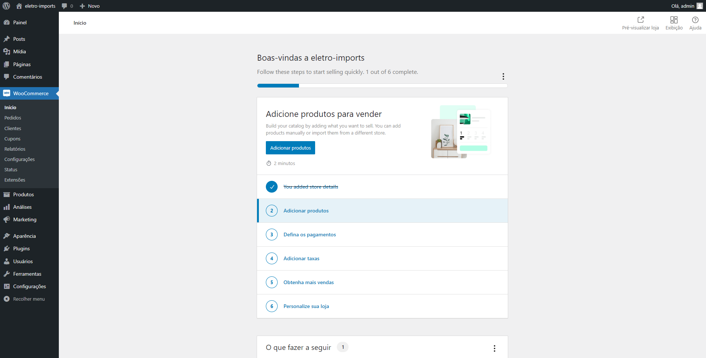

# Artigos: WooCommerce - Wordpress

Autor: Lucas de Oliveira Neitzke

[Retornar: Wordpress](../wordpress.md)

## Sumário

- [Artigos: WooCommerce - Wordpress](#artigos-woocommerce---wordpress)
  - [Sumário](#sumário)
  - [Introdução](#introdução)
  - [Instalação](#instalação)
  - [Referencias](#referencias)

## Introdução

O WooCommerce é a solução de comércio eletrônico de código aberto mais popular do mundo. Com ele você poder criar lojas de maneira fácil e rápida. 

Ele é um plugin de Wordpress, sendo assim eles está disponível apenas na loja oficial de plugins.

## Instalação

A instalação é facilitada para qualquer usuário, tendo em vista que é só você adicionar o plugin ao seu Wordpress instalado e ativa-lo.

Paaa instalarmos o WooCommerce, dentro do painel administrativo basta você seguir os seguintes passos:

1) Acesse a opção "plugins" encontrada na barra latera esquerda.

2) Pesquise no campo de pesquisar por "WooCommerce", e clique em "instalar agora" para adiciona-lo ao seu Wordpress.

3) Aparecerá no lugar do botão "instalar agora" o seguinte texto "Instalando...", isso significa que você deve permanecer na página até o fim do processo.
   
4) Após o fim da instalação aparecerá o botão "Ativar", clique nele e aguarde.

5) Você será redirecionado para a página de configuração do WooCommerce. Nela você deve preencher todos os dados básicos referentes a sua nova loja.

6) Após isso será pedido a sua autorização para a coleta de dados para a melhoria constante do software, caso você deseja, você pode clicar na opção "Não" que não afetará em nenhum aspecto.

7) Agora você deve selecionar o setor que sua loja se encaixa, caso não encontre nenhuma opção, marque outra e informe manualmente o setor desejado.

8) Selecione o tipo de produto que você deseja listar, no nosso caso utilizaremos apenas produtos físicos que é gratuito para utilizar.

9) O próximo passo será declarar quantos produtos você planeja exitir em sua loja. Será perguntado se você já vende em outro lugar, caso não queira informar selecione "Não" e clique em continuar.

10) Também será pedido se você deseja instalar recursos recomendados para seu negócio, você pode deixar essa opção desmarcada caso queira uma instalação "limpa".

11) Agora selecione o tema que mais lhe agrada e clique em "Escolher" e aguarde e posteriormente clique em "Confirmar com meu tema ativo".

12) Caso tudo ocorra como esperado, você será redirecionado a página inicial do WooCommerce.

## Referencias

- [WooCommerce Setup Wizard - WooCommerce (https://woocommerce.com/document/woocommerce-setup-wizard/)](https://woocommerce.com/document/woocommerce-setup-wizard/)